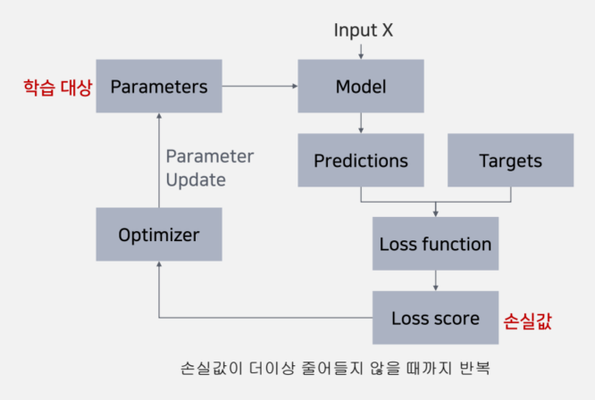
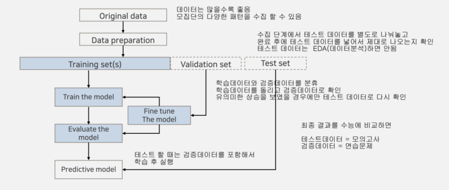

# 머신러닝의 이해
## 인공지능
- 인간의 학습능력, 추론능력, 지각능력을 인공적으로 구형하려는 컴퓨터 과학의 분야
- 머신러닝과 딥러닝을 포괄하는 종합적인 분야
- AI(Artificial Intelligence) > ML(Machine Learning) > DL(Deep Learning)
    - AI : 사람이 해야 할 일을 기계가 대신하도록 자동화
    - ML : 데이터로부터 의사결정을 위한 패턴을 기계가 스스로 학습
    - DL : 인공신경망 기반의 모델로 비정형 데이터로부터 특징 추출 및 판단까지 한 번에 수행

## 머신러닝
### 분류(학습방식에 따라)
- 지도학습
    - 모델(알고리즘)에 입력 값(특성)과 출력 값(정답)을 같이 넣어 학습
    - 분류(Classification) : 정답 값이 범주형 데이터인 경우
        - Binary : 두 가지의 범주 + 샘플당 한 개의 정답 값 -> 정상/비정상
        - Multi-class : 세 가지 이상의 범주 + 샘플당 한 개의 정답 값 -> 고양이/호랑이/사자
        - Multi-label : 세 가지 이상의 범주 + 샘플당 0개 이상의 정답 값 => 딥러닝으로 해결
    - 회귀(Regression) : 정답 값이 수치형 데이터인 경우
- 비지도학습
    - 모델(알고리즘)에 입력 값(특성)만 넣어 학습
    - 군집화(Clustering) : 주어진 데이터를 유사한 데이터들의 그룹으로 나누는 것
    - 차원축소(Dimensionality reduction) : 고차원의 데이터를 저차원의 데이터로 변환하는 것

### 학습원리
- 입력 값을 받은 모델의 출력 값 <------> 정답 값
- 그 사이의 오차(손실)을 최소화하는 방향으로 모델의 파라미터를 찾음

### 기초용어
- feature/독립변수/설명변수 : 학습데이터의 특성
- class/label/target/종속변수 : 정답 데이터
- parameter : 모델이 학습과정에서 업데이트하는 파라미터
- hyper parameter : 사용자가 직접 설정하는 파라미터
- loss/손실 : 정답 값과 예측 값의 오차를 표현하는 지표
- metrics/평가지표 : 모델의 성능을 평가할 때 사용하는 지표

## 머신러닝 파이프라인
- 머신러닝 기술을 활용함에 있어서 초기 기획부터 데이터 수집, 가공, 분석, 사후관리까지 일련의 전체 과정
- 문제 정의부터 데이터 수집, 전처리, 학습, 모델 배포, 모니터링까지 전 과정을 순차적으로 처리하도록 설계된 머신러닝 아키텍처
- 파이프라인 : 한 데이터 처리 단계의 출력이 다음 단계의 입력으로 이어지는 형태로 연결된 구조

### 문제정의
- 비즈니스 목적에 맞게 문제를 구체화하는 단계
- 머신러닝 타당성 확인 : 머신러닝 모델을 통해 어떠한 이익을 얻을 수 있는지 파악 
- 데이터 수집 방안 정의 : 내부 데이터가 있는지에 대한 여부 / 외부 데이터 수집 가능 여부
- 학습 방법 : 데이터의 유형에 따라 학습 유형(지도학습, 비지도학습 / 회귀, 분류)을 정의
- 성능 측정 지표 선택 : 적절한 평가지표 선택

### 데이터 수집
- 데이터 구조 확인
    - 학습 및 평가에 사용할 수 없는 데이터 제거
- 테스트 세트 생성
    - 모델 평가를 위한 테스트 세트 생성
    - 일반적으로 20 ~ 30%의 데이터를 테스트 세트로 분리
    - 데이터 양이 많으면 50%까지 늘리는 경우도 있음
    - 시계열 데이터의 경우, 최근 데이터로 분리
    - 테스트 세트에 대해서는 EDA(탐색적 데이터 분석) 진행 X

### 데이터 분석
- 데이터 이해를 위한 탐색과 시각화
- 학습 데이터에 대해서만 탐색을 진행

### 특성 공학
- 데이터 정제 : 이상치 제거, 결측치 처리 등
- 범주형 특성 인코딩 : 범주형 특성을 숫자 형태로 변환
- 특성 스케잉일 : 모든 특성의 범위를 같도록 만들어주는 방법

### 데이터 분리
- 모델 평가 전에 모델의 성능을 검증하는 검증 세트 생성
- Hold-out 방식 / K-fold 방식

### 모델 학습
- 모델 선택과 학습
- 검증 세트를 이용하여 모델 평가

### 모델 평가
- 테스트 세트를 이용하여 모델 평가

### 모델 배포
- 학습된 모델을 시스템에 적용
- 전용 웹서비스 등에 학습된 모델을 배포

### 모니터링
- 모델 실전 성능 모니터링